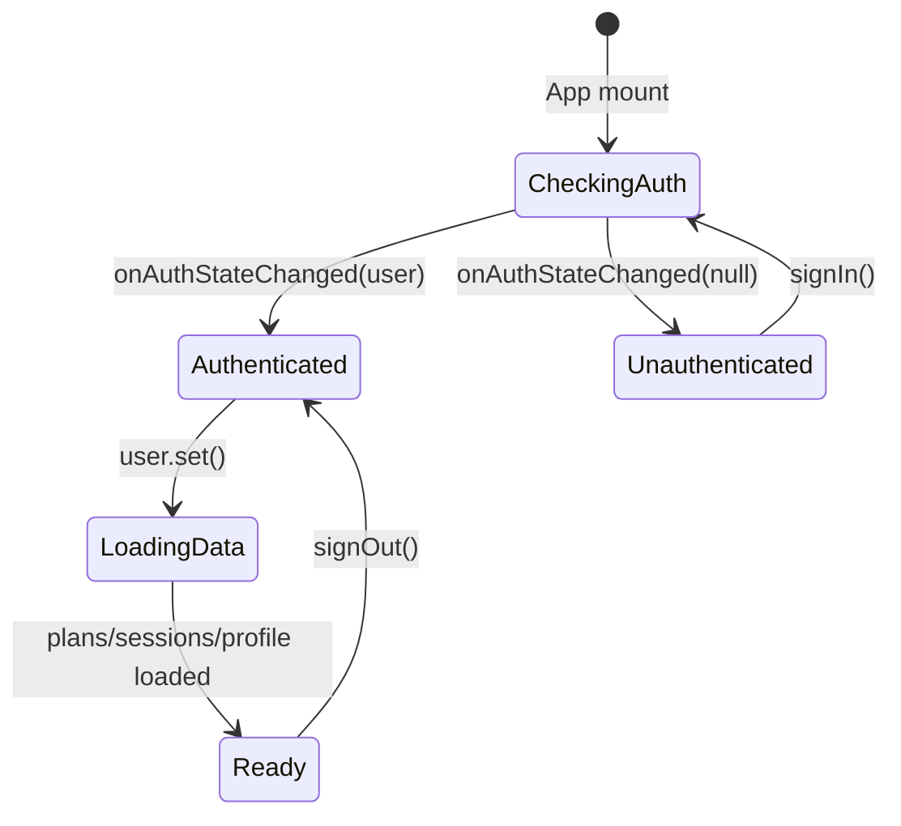

# Auth - Firebase Auth

## Visão Geral

Firebase Authentication gerencia identidade do usuário com dois provedores:
- **Email/Password** (tradicional)
- **Google OAuth** (web + nativo via Capacitor)

## Configuração

```typescript
// src/lib/firebase.ts
const firebaseConfig = {
  apiKey: import.meta.env.VITE_FIREBASE_API_KEY,
  authDomain: import.meta.env.VITE_FIREBASE_AUTH_DOMAIN,
  projectId: import.meta.env.VITE_FIREBASE_PROJECT_ID,
  storageBucket: import.meta.env.VITE_FIREBASE_STORAGE_BUCKET,
  messagingSenderId: import.meta.env.VITE_FIREBASE_MESSAGING_SENDER_ID,
  appId: import.meta.env.VITE_FIREBASE_APP_ID,
};
```

## Fluxos de Login

### 1. Email/Password

```
User → Login.tsx (email + senha)
    → signInWithEmailAndPassword()
    → onAuthStateChanged() → App.tsx
    → Carrega profile/settings do Firestore
```

### 2. Google OAuth (Web)

```
User → "Entrar com Google" → window.location.href = Google OAuth URL
    → Google Consent → Redirect para https://correlogo.web.app/auth/google/callback
    → Cloud Function authCallback troca code → access_token
    → Redirect para /?gcal_token=... (Calendar) ou /?token=... (Gmail)
    → App.tsx captura query param → signInWithCredential(GoogleAuthProvider.credential(token))
    → onAuthStateChanged() → App.tsx
```

### 3. Google OAuth (APK/Nativo)

```
User → "Entrar com Google" → Browser.open(Chrome Custom Tab)
    → Google Consent → Redirect para Cloud Function
    → Cloud Function troca code → access_token
    → Redirect para com.correlogo.app://oauth/callback?token=...&state=c3_...
    → App.tsx appUrlOpen listener captura deep link
    → signInWithCredential(GoogleAuthProvider.credential(token))
    → onAuthStateChanged() → App.tsx
```

> **Nota**: APK usa `@capacitor-firebase/authentication` com `skipNativeAuth: true`. O plugin nativo só retorna `idToken`, que é trocado por credential Firebase.

## Cloud Function: authCallback

```typescript
// functions/src/index.ts
export const authCallback = onRequest(async (req, res) => {
  const { code, state } = req.query;
  
  // Troca code por tokens
  const tokens = await fetch('https://oauth2.googleapis.com/token', {
    method: 'POST',
    body: JSON.stringify({
      client_id: WEB_CLIENT_ID,
      client_secret: WEB_CLIENT_SECRET,
      code,
      grant_type: 'authorization_code',
      redirect_uri: 'https://correlogo.web.app/auth/google/callback'
    })
  });
  
  // Roteia por state prefix
  const isNative = state.startsWith('c3_') || state.startsWith('gm_');
  if (isNative) {
    res.redirect(`com.correlogo.app://oauth/callback?token=${tokens.access_token}&state=${state}`);
  } else {
    res.redirect(`/?gcal_token=${tokens.access_token}&state=${state}`);
  }
});
```

## State Machine - App.tsx



## Inicialização (App.tsx)

```typescript
useEffect(() => {
  const unsub = onAuthStateChanged(auth, async (user) => {
    if (user) {
      setUser(user);
      // Carrega dados paralelos
      await Promise.all([
        loadPlans(user.uid),
        loadSessions(user.uid),
        loadProfile(user.uid),
        loadSettings(user.uid),
      ]);
      setInitialized(true);
    } else {
      setUser(null);
      setInitialized(true);
    }
  });
  return unsub;
}, []);
```

## Persistência & Offline

| Dado | Local | Firestore | Sync |
|------|-------|-----------|------|
| User | Firebase Auth | - | Auto |
| Profile | `correlogo:profile:{uid}` | `users/{uid}/data/profile` | Last write wins |
| Settings | `correlogo:settings:{uid}` | `users/{uid}/data/settings` | Last write wins |
| Plans | `correlogo:plans:{uid}` | `users/{uid}/plans` | Merge (local + remote) |
| Sessions | `correlogo:sessions:{uid}` | `users/{uid}/sessions` | `local-*` → upload |

## Error Handling (PT-BR)

```typescript
// src/lib/firebaseErrorsPtBr.ts
export function getFirebaseErrorPt(err: any): string {
  const code = err?.code;
  const map: Record<string, string> = {
    'auth/invalid-email': 'E-mail inválido.',
    'auth/user-not-found': 'Usuário não encontrado.',
    'auth/wrong-password': 'Senha incorreta.',
    'auth/email-already-in-use': 'E-mail já cadastrado.',
    'auth/weak-password': 'Senha muito fraca (mín. 6 caracteres).',
    'auth/network-request-failed': 'Sem conexão. Verifique sua internet.',
    'auth/too-many-requests': 'Muitas tentativas. Tente novamente mais tarde.',
  };
  return map[code] || err?.message || 'Erro desconhecido.';
}
```

## Security Rules (Firestore)

```javascript
// firestore.rules
rules_version = '2';
service cloud.firestore {
  match /databases/{database}/documents {
    match /users/{uid}/{document=**} {
      allow read, write: if request.auth != null && request.auth.uid == uid;
    }
  }
}
```

## Troubleshooting

| Erro | Causa | Solução |
|------|-------|---------|
| `auth/invalid-credential` | SHA-1 errado no Firebase Console | Atualizar SHA-1 do debug keystore |
| `redirect_uri_mismatch` | Client ID errado (Android vs Web) | Usar Web Client ID para OAuth |
| `network-request-failed` | Sem internet / firewall | Verificar conexão, tentar novamente |
| `auth/internal-error` (APK) | `google-services.json` desatualizado | Baixar novo do Firebase Console |

---

*Última revisão: 2026-07-29*