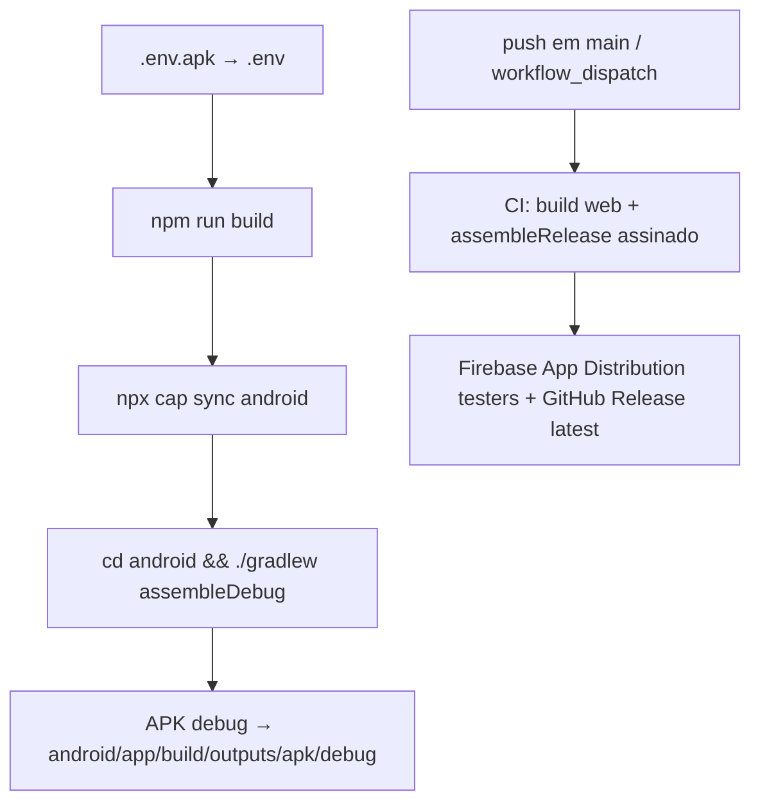

# Build - APK Pipeline

## Pipeline Completo



---

## Build local (debug)

```bash
# 1. Preparar ambiente (APK usa Firebase prod)
Copy-Item -Path ".env.apk" -Destination ".env" -Force

# 2. Build web
npm run build

# 3. Sync Capacitor
npx cap sync android

# 4. Build APK
cd android
$env:JAVA_HOME = "C:\Program Files\Eclipse Adoptium\jdk-21.0.11.10-hotspot"
./gradlew assembleDebug
# Saída: android/app/build/outputs/apk/debug/app-debug.apk
```

> ⚠️ **NUNCA** copie `.env.dev` → `.env` — quebra o APK e o site em produção.

---

## Variáveis de Ambiente

| Arquivo | Uso |
|---------|-----|
| `.env.apk` | **Única fonte para APK** - Firebase prod (`correlogo-prod`) + Web Client ID |
| `.env.dev` | Dev local - Firebase dev (`correlogo-dev-9a96a`) |
| `functions/.env` | Cloud Functions secrets |
| `.env` | Gerado no build (não commitado) |

---

## JAVA_HOME

```powershell
$env:JAVA_HOME = "C:\Program Files\Eclipse Adoptium\jdk-21.0.11.10-hotspot"
```

> Verificar: `java -version` → deve ser 21+

---

## Gradle Commands

| Comando | Descrição |
|---------|-----------|
| `./gradlew assembleDebug` | Build debug APK |
| `./gradlew assembleRelease` | Build release APK assinado |
| `./gradlew clean` | Limpa build |
| `./gradlew tasks` | Lista tasks |

---

## Troubleshooting Build

| Erro | Causa | Fix |
|------|-------|-----|
| `JAVA_HOME not set` | JDK não configurado | Set `JAVA_HOME` |
| `Could not find method google()` | Plugin Google Services faltando | `classpath 'com.google.gms:google-services:4.4.0'` |
| `Manifest merger failed` | Permissões conflitantes | Verificar `AndroidManifest.xml` |
| `Duplicate class` | Dependências duplicadas | `./gradlew dependencies` → excluir |
| `OutOfMemoryError` | Heap insuficiente | `org.gradle.jvmargs=-Xmx4g` em `gradle.properties` |
| `License not accepted` | SDK licenses | `yes | sdkmanager --licenses` |

---

## CI/CD (GitHub Actions — Real)

### Workflow: `.github/workflows/firebase-deploy.yml`

Triggers: **push em `main`** + `workflow_dispatch`.

Pipeline do CI:

1. Checkout + Node 20 + JDK 21 (temurin) + Android SDK (`android-actions/setup-android@v3`)
2. `base64 -d <<< "${{ secrets.ENV_FILE }}" > .env` — restaura o `.env.apk`
3. `npm ci --legacy-peer-deps` → `npm run build` → `npx cap sync android`
4. Restaura `android/app/google-services.json` (`GOOGLE_SERVICES_B64`) e `android/app/keystore.jks` (`KEYSTORE_BASE64`)
5. `CI_VERSION_CODE = GITHUB_RUN_NUMBER + 100` (passado via `-PciVersionCode`)
6. `./gradlew assembleRelease` com signing injetado:
   ```
   -Pandroid.injected.signing.store.file=keystore.jks \
   -Pandroid.injected.signing.store.password="${{ secrets.KEYSTORE_PASSWORD }}" \
   -Pandroid.injected.signing.key.alias="${{ secrets.KEY_ALIAS }}" \
   -Pandroid.injected.signing.key.password="${{ secrets.KEY_PASSWORD }}" \
   -PciVersionCode=$CI_VERSION_CODE
   ```
7. **Firebase App Distribution** (grupo `testers`) via `firebase appdistribution:distribute`
8. **GitHub Release `latest`** — move a tag `latest` para o HEAD, faz upload (ou cria) com `app-release.apk` + `update-manifest.json` (base do **auto-update in-app**)
9. Cleanup de `keystore.jks`, `google-services.json`, `firebase-key.json` (`if: always()`)

### Secrets necessários

| Secret | Descrição |
|--------|-----------|
| `ENV_FILE` | `.env.apk` em base64 (`$(base64 -w0 .env.apk)`) |
| `GOOGLE_SERVICES_B64` | `android/app/google-services.json` em base64 |
| `KEYSTORE_BASE64` | `android/app/keystore.jks` em base64 |
| `KEYSTORE_PASSWORD` | Senha do keystore |
| `KEY_ALIAS` | Alias da key no keystore |
| `KEY_PASSWORD` | Senha da key |
| `FIREBASE_CREDENTIALS` | Service account do Firebase (admin) em base64 → `firebase-key.json` |
| `FIREBASE_APP_ID` | App ID do Firebase Android (App Distribution) |

> Os `.txt` base64 locais (`gh_env_base64.txt`, `gh_firebase_cred_base64.txt`, `gh_keystore_base64.txt`) são gitignored (`gh_*.txt`) — servem para recriar os secrets.

---

*Última revisão: 2026-07-31*
