# 🖼️ Telas do App (Demonstração)

Telas demonstrativas do Corre Logo, fiéis ao **Design System Pôr-do-Sol** (tokens em `src/index.css`). As imagens são **renders estáticos dos mockups** em [`mockups/`](../../../mockups/) capturados via Chrome headless — não são screenshots de device.

> ⚠️ Os mockups foram atualizados em 2026-09-12 para refletir o novo card de esteira **read-only** (telemetria real como fonte da verdade). Ver [WorkoutTracker](../tracking/workout-tracker.md) e [FTMS](../tracking/ftms.md).

---

## 🏃 Treino (WorkoutTracker)

A tela central do app: plano guiado com anúncios de voz, estatísticas em tempo real, cinta cardíaca (HR zone) e card de esteira (ou mapa, no outdoor).

| Estado | Tela |
|--------|------|
| **Esteira conectada** — telemetria real (velocidade + inclinação + distância híbrida odômetro/velocidade), cinta HR na zona | 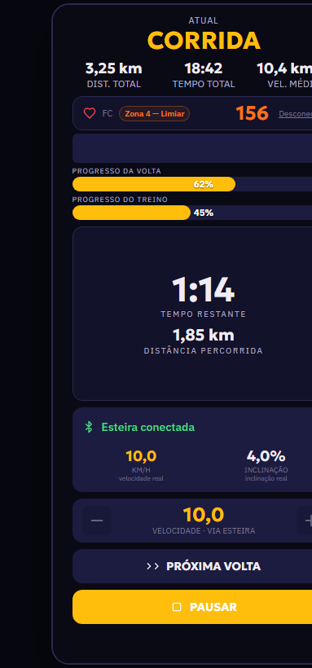 |
| **Pausada — finalizar** — marquee parado, barra de hold parcial | 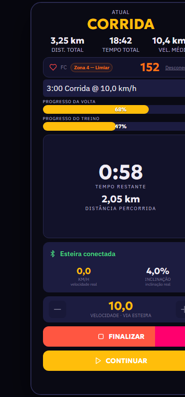 |
| **Esteira desconectada** — falha de BLE / sem cinta; barra de velocidade volta a ser o controle manual | 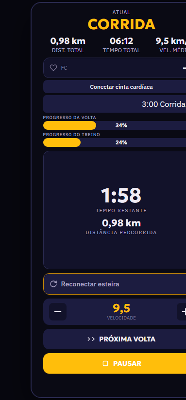 |
| **Treino Livre** — esteira conectada, sem plano | 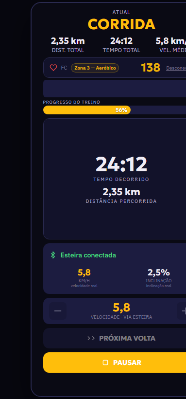 |
| **Outdoor (GPS)** — mapa em vez do painel BLE | 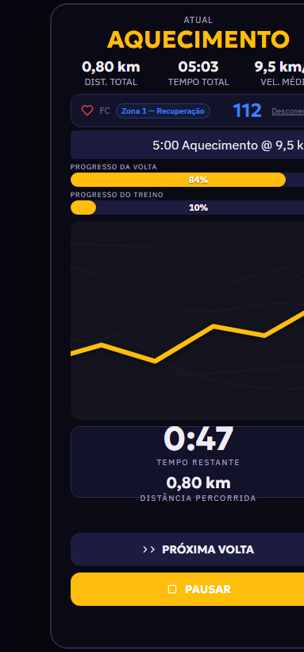 |

---

## 🎛️ Gerador de Treinos

Wizard de 4 etapas (objetivo → condicionamento → dias/modo → nível). Abaixo, a **Etapa 1** com objetivo **10K**, datas preenchidas, pace alvo `5:00` e o alerta de melhora muito agressiva para o prazo.

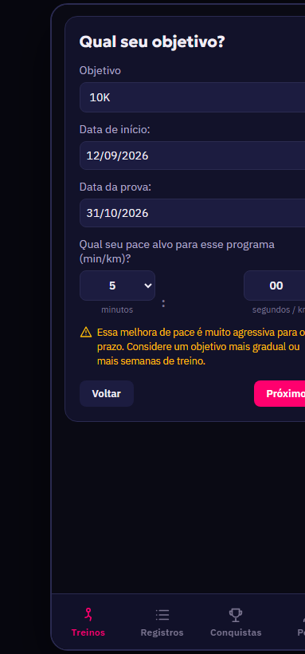

---

## 🗂️ Registros

Histórico de sessões com cards de sincronização (Gmail/HC em verde quando ok, âmbar quando pendente), badge "Relógio" para sessões importadas de smartwatch, e exclusão por card.

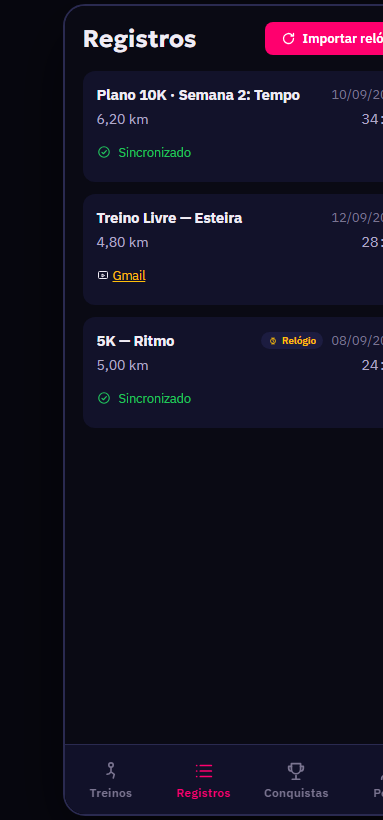

---

## 🏆 Conquistas

Estatísticas (recordes / conquistas / km totais), badges por grupo (Corridas, Distância, Volume, Ritmo) com medalha ou cadeado, e a lista de recordes pessoais por distância com modo (Rua/Esteira) e data.

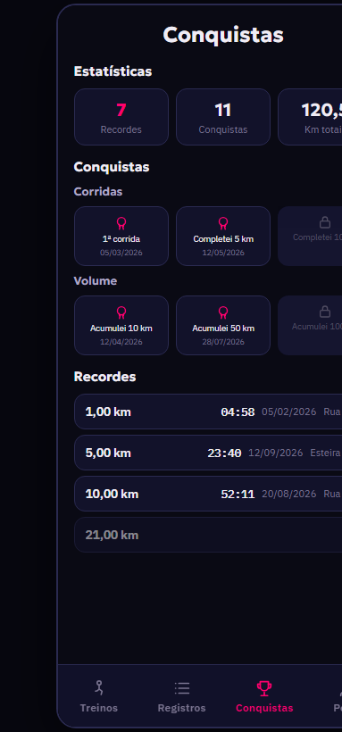

---

## 📤 Share Cards (Destaque)

Cards de treino em 4 variantes no formato **1080×1920** para Instagram Stories.

| Variante | Tela |
|----------|------|
| **Card 1 · Stats + Pace** | 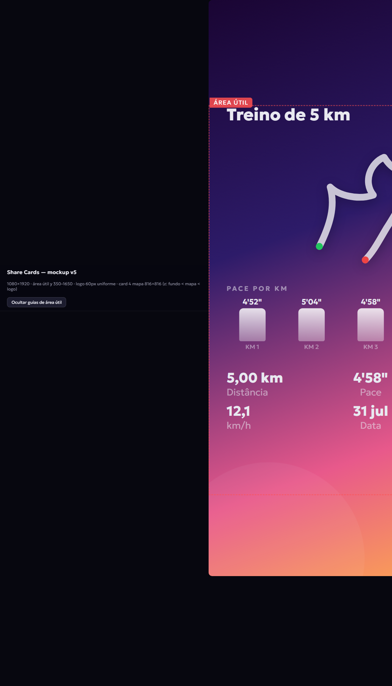 |
| **Card 2 · Stats à esquerda** | 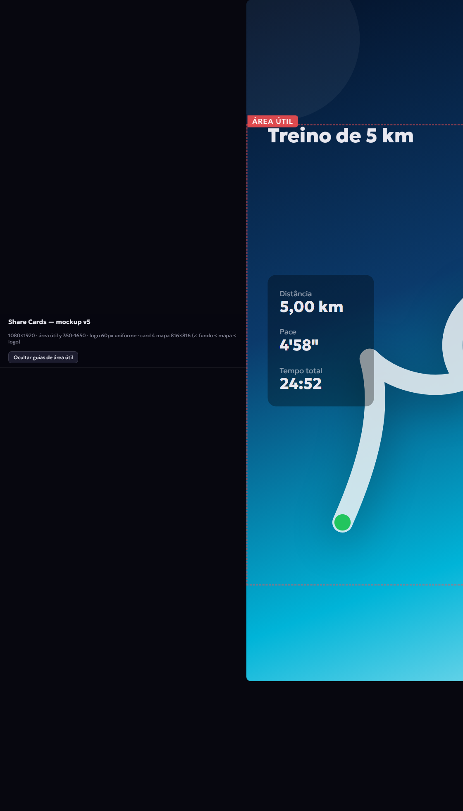 |
| **Card 3 · Stats embaixo** | 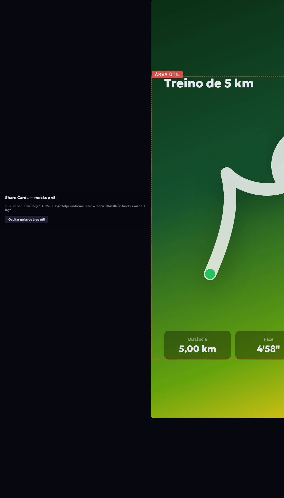 |
| **Card 4 · Mapa real + traçado** | 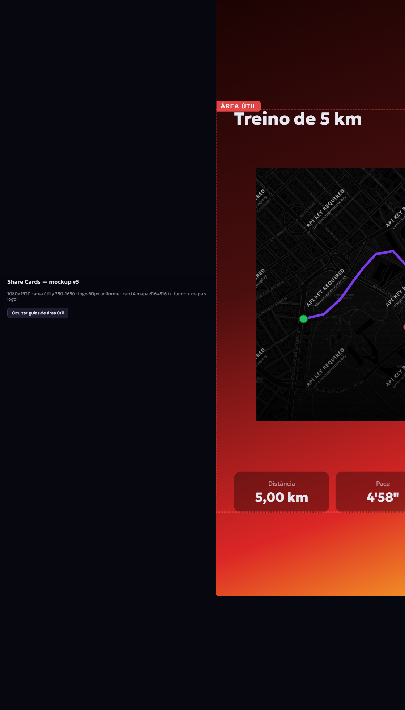 |

---

## 🔧 Como reproduzir os renders

```bash
# Abrir qualquer variante isolada no navegador
mockups/workout-tela-treino.html?tela=1   # ..5 (telas de treino)
mockups/outras-telas.html?tela=1          # gerador | registros | conquistas
mockups/share-cards.html?tela=1           # ..4 (cards de share)

# Render PNG via Chrome headless (Windows)
& "C:\Program Files\Google\Chrome\Application\chrome.exe" --headless --disable-gpu --hide-scrollbars `
  "--screenshot=docs/screens/workout-esteira-conectada.png" --window-size=383,820 `
  "file:///D:/Trabalho/Corre-Logo/mockups/workout-tela-treino.html?tela=1"
```

*Última atualização: 2026-09-12*