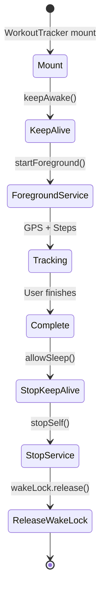

# Tracking - WakeLock & Foreground Service

## Visão Geral

WakeLock mantém CPU ativa durante treino para:
- Timer nativo continuar rodando
- GPS updates em background
- TTS não ser interrompido

---

## Implementation

### Kotlin - TrackingService.kt

```kotlin
class TrackingService : Service() {
    private var wakeLock: PowerManager.WakeLock? = null
    private val NOTIFICATION_ID = 1001

    override fun onCreate() {
        super.onCreate()
        val pm = getSystemService(POWER_SERVICE) as PowerManager
        wakeLock = pm.newWakeLock(
            PowerManager.PARTIAL_WAKE_LOCK,
            "CorreLogo::TrackingWakeLock"
        )
    }

    override fun onStartCommand(intent: Intent?, flags: Int, startId: Int): Int {
        when (intent?.action) {
            "START_TRACKING", "KEEP_ALIVE" -> {
                // Adquire wake lock
                wakeLock?.acquire()
                
                // Foreground notification
                val notification = buildNotification()
                startForeground(NOTIFICATION_ID, notification)
                
                // Inicia GPS + Step Counter
                startLocationUpdates()
                startStepCounter()
            }
            "STOP_KEEP_ALIVE" -> {
                stopForeground(true)
                stopLocationUpdates()
                stopStepCounter()
                wakeLock?.release()
                stopSelf()
            }
        }
        return START_STICKY
    }

    override fun onDestroy() {
        wakeLock?.release()
        stopForeground(true)
        super.onDestroy()
    }
}
```

### Notification (Foreground)

```kotlin
private fun buildNotification(): Notification {
    return NotificationCompat.Builder(this, "tracking_channel")
        .setContentTitle("Corre Logo - Treino em andamento")
        .setContentText("Toque para abrir")
        .setSmallIcon(R.drawable.ic_notification)
        .setOngoing(true)
        .setPriority(NotificationCompat.PRIORITY_LOW)
        .setCategory(NotificationCompat.CATEGORY_SERVICE)
        .build()
}
```

### Channel

```kotlin
private fun createNotificationChannel() {
    if (Build.VERSION.SDK_INT >= Build.VERSION_CODES.O) {
        val channel = NotificationChannel(
            "tracking_channel",
            "Corre Logo Tracking",
            NotificationManager.IMPORTANCE_LOW
        ).apply {
            description = "Mantém GPS e timer ativos durante treino"
            setSound(null, null) // Silencioso
            enableVibration(false)
        }
        notificationManager.createNotificationChannel(channel)
    }
}
```

---

## JS Bridge

```typescript
// src/lib/capacitor/wakelock.ts
import { Plugins } from '@capacitor/core';

const { KeepAwake } = Plugins;

export const keepAwake = async () => {
  await KeepAwake.keepAwake(); // Chama startKeepAlive nativo
};

export const allowSleep = async () => {
  await KeepAwake.allowSleep(); // Chama stopKeepAlive nativo
};
```

### Usage (WorkoutTracker)

```typescript
// WorkoutTracker.tsx
useEffect(() => {
  keepAwake(); // Mount
  
  return () => {
    allowSleep(); // Unmount / Complete
  };
}, []);

// Esteira apenas (sem GPS)
if (mode === 'treadmill') {
  keepAwake(); // Keep alive sem GPS
}
```

---

## Wake Lock Types

| Tipo | Uso | Battery |
|-------|-------|---------|
| `PARTIAL_WAKE_LOCK` | CPU ativa, tela pode apagar | Baixo |
| `FULL_WAKE_LOCK` | CPU + tela acesa | Alto (deprecated) |
| `SCREEN_BRIGHT_WAKE_LOCK` | Tela brilho máximo | Alto |

> App usa `PARTIAL_WAKE_LOCK` — CPU ativa, tela gerida pelo usuário.

---

## Permissions

```xml
<!-- AndroidManifest.xml -->
<uses-permission android:name="android.permission.WAKE_LOCK" />
<uses-permission android:name="android.permission.FOREGROUND_SERVICE" />
<uses-permission android:name="android.permission.FOREGROUND_SERVICE_HEALTH" />
```

---

## Lifecycle Integration



---

## Battery Optimization (Doze Mode)

| Cenário | Comportamento |
|---------|---------------|
| Tela ligada | Funciona normal |
| Tela apagada (foreground) | WakeLock mantém CPU |
| Doze mode (app background) | Foreground Service ignora Doze |
| App killed pelo sistema | Service reinicia (START_STICKY) |

---

## Troubleshooting

| Sintoma | Causa | Fix |
|---------|-------|-----|
| Timer para quando tela apaga | WakeLock não adquirido | Verificar `PARTIAL_WAKE_LOCK` |
| GPS para em background | Serviço morto | Foreground Service + START_STICKY |
| App crash ao liberar | WakeLock já liberado | Null check antes de `release()` |
| Notificação não some | `stopForeground(false)` | Usar `stopForeground(true)` |

---

## Testing

```bash
# Verificar wake lock ativo
adb shell dumpsys power | grep WAKE_LOCK

# Verificar foreground service
adb shell dumpsys activity services | grep TrackingService

# Simular Doze
adb shell cmd deviceidle force-idle
adb shell cmd deviceidle step
```

---

*Última revisão: 2026-07-29*